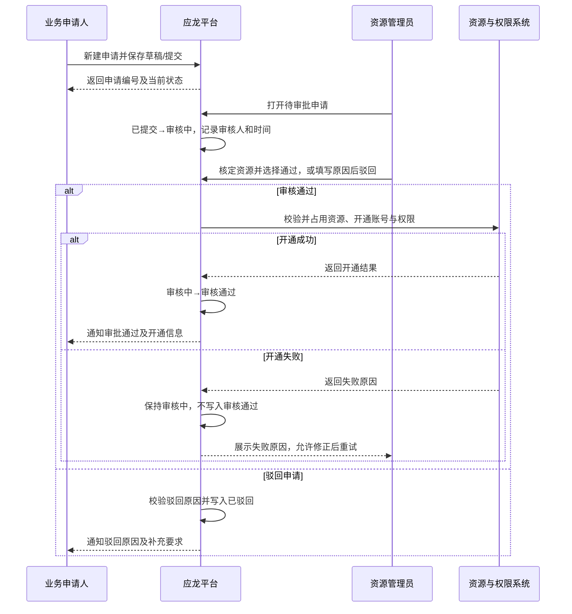
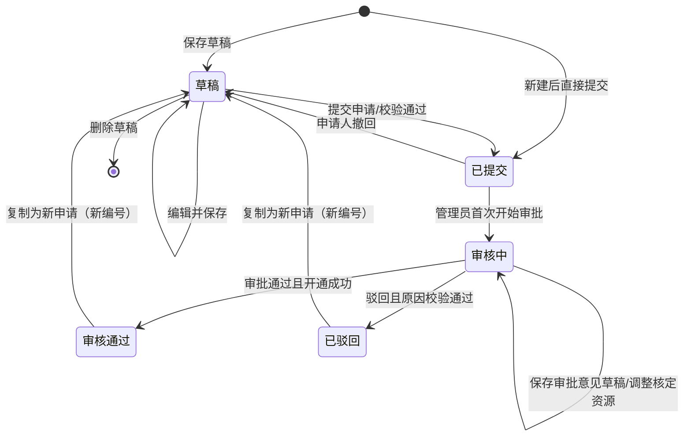

# 应龙 AI 算力基座——模型纳管与资源授权审批 PRD

| 项目 | 内容 |
|---|---|
| 文档版本 | V1.0 |
| 文档日期 | 2026-08-17 |
| 产品范围 | 模型纳管、部署资源申请、资源审批、账号授权 |
| 原型来源 | `sys_model_governance.html`、`sys_resource_approval.html` |
| 文档状态 | 待评审 |

## 1. 文档说明

本 PRD 将“模型纳管”申请端与“授权审批”管理端合并为一个完整业务闭环，重点定义：

1. 主线/非主线模型的纳管路径及责任边界；
2. 线下验证服务器、平台账号和资源两类申请的创建与管理；
3. 从草稿、提交、审核到开通/驳回的审批状态流转；
4. 资源管理员核定服务器、账号、集群、节点、GPU 数量和权限的操作规则；
5. 审批通过后的账号授权沉淀、查询和人工补充授权。

原型中的本地存储、演示数据、“空状态/列表状态”切换仅用于交互演示，不属于生产功能。本文对必须产品化的事务、并发、幂等和审计规则进行了补充；与原型存在差异的内容会明确标注。

## 2. 背景与目标

### 2.1 背景

平台同时承载主线模型和业务自带的非主线模型。主线模型由平台统一建设和维护；非主线模型需要业务方先完成选型、镜像、接口和效果验证，再申请平台账号、部署权限及长期运行资源。当前需要将申请与资源管理员审批打通，形成可追踪、可审计、可核定资源的闭环。

### 2.2 产品目标

- 业务方在一个页面完成纳管规则查询、流程理解、材料准备和资源申请。
- 明确区分“线下验证服务器”与“平台账号和资源”，减少申请类型误选。
- 资源管理员可在审批时看到集群实时资源，并核定实际资源而非机械照批。
- 审批结果回写申请端；平台类申请通过后自动生成账号授权记录。
- 所有状态变化、审批意见和资源开通结果可审计、可追溯。

### 2.3 非目标

- 本期不包含模型权重、镜像、YAML、测试报告等文件的在线上传和内容审核；页面仅展示材料清单。
- 本期不设计多级会签、加签、转审和委托审批。
- 本期不包含账号授权的编辑、撤销、到期续期；“账号授权”页仅查询和新增。
- 本期不负责模型部署执行、服务发布和运行监控，只负责申请、审批和授权结果同步。

## 3. 用户角色与权限

| 角色 | 主要目标 | 可执行操作 |
|---|---|---|
| 业务申请人 | 了解纳管规则并申请验证/部署资源 | 新建、保存草稿、提交、查看、编辑草稿、撤回已提交申请、复制、删除草稿 |
| 部署操作人 | 获得服务器或平台部署权限并实际部署 | 作为申请字段被指定；审批通过后获得相应资源/账号权限 |
| 资源管理员 | 审核申请、核定资源、维护账号授权 | 查看全部非草稿申请、开始审核、通过并开通、驳回、保存驳回意见草稿、新增账号授权 |
| 系统 | 维护状态、校验库存、执行授权、记录审计 | 编号生成、状态更新、资源占用校验、权限同步、通知、审计记录 |

权限原则：

- “模型纳管”页面对有模型管理/资源申请权限的用户开放，申请列表默认只展示当前用户本人或其被授权项目组的申请。
- “授权审批”页面仅资源管理员可操作；无权限用户访问时返回 403 页面或隐藏导航入口。
- 管理员可查看申请信息，但除审批核定字段外不得修改申请人原始申报内容。
- 所有写操作必须由后端鉴权，不得仅依赖前端按钮显隐。

## 4. 核心业务对象与术语

### 4.1 申请类型

| 类型 | 业务用途 | 资源特征 | 审批通过结果 |
|---|---|---|---|
| 线下验证服务器 | 模型纳管前的短期独立环境验证；已有验证环境或结论时可跳过 | 有明确开始/结束时间，分配服务器 IP、GPU 型号/数量和有效期 | 开通一台可访问的验证服务器；到期后进入释放流程 |
| 平台账号和资源 | 模型长期在平台运行，或已验证模型进入正式部署 | 核定平台账号、集群、GPU 型号/数量、集群/节点范围及操作权限 | 同步开通账号、算力资源和权限，并生成账号授权记录 |

统一术语要求：前后端、筛选项、数据库和通知中统一使用“平台账号和资源”。原型中出现的“平台账号资源”“平台部署资源”“账号部署权限和平台资源”等历史文案仅用于兼容旧数据，新增数据不得继续写入旧名称。

### 4.2 模型纳管责任边界

- 主线模型：平台负责部署、升级、监控和维护；业务方申请时提供业务系统、调用场景、预估调用量。
- 非主线模型：业务方负责模型选型、权重与授权确认、镜像制作、接口封装、效果验证，以及正式纳管后的部署、升级和维护。
- 平台负责资源核定、账号权限开通和基础设施可用性，不对业务模型效果和版权授权承担责任。

## 5. 总体业务流程

### 5.1 模型纳管六步流程

1. **优先调用主线模型**：确认通用大模型、Embedding、Reranker 等平台主线能力是否满足场景。
2. **申请线下验证服务器（可选）**：需要独立验证环境时发起申请；已有环境或验证结论可跳过。
3. **完成线下部署验证**：业务方完成依赖适配、模型启动、接口暴露、效果验证和资源评估。
4. **准备纳管材料**：准备模型信息、模型权重、部署镜像、K8s 启动 YAML、接口文档、性能测试报告和测试样例数据。
5. **申请平台权限和资源**：提交验证结论、上线计划和资源需求，由资源管理员核定。
6. **在平台部署与维护**：账号、权限和配额开通后，由业务方完成部署、发布、升级和调参。

### 5.2 端到端审批主流程

## 6. 审批状态机（重点）

### 6.1 状态定义

| 状态 | 状态码建议 | 定义 | 是否终态 |
|---|---|---|---|
| 草稿 | `DRAFT` | 申请尚未进入审批，可继续修改或删除 | 否 |
| 已提交 | `SUBMITTED` | 申请已提交，等待资源管理员受理 | 否 |
| 审核中 | `REVIEWING` | 资源管理员已开始处理，正在核定资源或填写意见 | 否 |
| 审核通过 | `APPROVED` | 审批通过且资源/账号/权限已成功开通 | 是 |
| 已驳回 | `REJECTED` | 申请未通过，已记录驳回原因 | 是 |

“审核通过”必须同时代表业务审批通过和开通成功。不得先将状态写为“审核通过”，再异步开通而不反馈失败；若开通失败，应保持“审核中”。如未来需要异步长流程，应新增“开通中/开通失败”状态，本期不扩展。

### 6.2 状态流转图

说明：终态记录本身不回到草稿。图中的“复制为新申请”会创建一个全新的申请实例和编号，原记录保持不变。

### 6.3 状态流转明细

| 当前状态 | 角色 | 触发动作 | 前置校验 | 下一状态 | 系统写入与副作用 |
|---|---|---|---|---|---|
| 无 | 申请人 | 保存草稿 | 至少填写申请名称 | 草稿 | 生成申请编号；保存当前已填字段、创建人、创建时间、更新时间 |
| 无 | 申请人 | 直接提交 | 所有对应类型必填项通过 | 已提交 | 生成编号；记录提交时间；进入管理员待办；通知资源管理员 |
| 草稿 | 申请人 | 编辑并保存 | 申请仍为草稿；版本号一致 | 草稿 | 更新字段和更新时间；写入操作日志 |
| 草稿 | 申请人 | 提交申请 | 必填项、数值和时间范围通过 | 已提交 | 记录提交时间；锁定申请原始内容；生成待办和通知 |
| 草稿 | 申请人 | 删除 | 二次确认；申请仍为草稿 | 记录删除 | 软删除并写审计日志；列表不再展示 |
| 已提交 | 申请人 | 撤回 | 管理员尚未开始审核 | 草稿 | 清除提交待办；保留申请内容；记录撤回时间和操作人 |
| 已提交 | 资源管理员 | 首次点击“审批/开始审核” | 有审批权限；申请未被其他管理员锁定 | 审核中 | 记录当前审核人、开始审核时间和版本号；刷新申请端状态 |
| 审核中 | 资源管理员 | 保存审批意见 | 当前选择“驳回”；内容可为空或不满足最终提交长度 | 审核中 | 保存私人/共享审批草稿（需产品确认可见范围）；不通知申请人 |
| 审核中 | 资源管理员 | 审核通过并开通 | 核定字段完整；库存充足；账号有效；授权成功 | 审核通过 | 写审批人/时间、核定结果、开通结果；扣减/占用资源；平台类生成授权记录；通知申请人 |
| 审核中 | 资源管理员 | 确认驳回 | 驳回原因不少于 10 个字符，且说明需补充内容 | 已驳回 | 写审批人/时间和意见；关闭待办；通知申请人 |
| 审核通过/已驳回 | 申请人 | 复制申请 | 有原记录查看权限 | 新记录为草稿 | 复制业务字段；新编号；名称追加“（复制）”；清空审批意见、开通结果和审批信息 |

### 6.4 各状态允许操作矩阵

| 操作 | 草稿 | 已提交 | 审核中 | 审核通过 | 已驳回 |
|---|:---:|:---:|:---:|:---:|:---:|
| 查看详情 | ✓ | ✓ | ✓ | ✓ | ✓ |
| 编辑 | ✓ | — | — | — | — |
| 提交 | ✓ | — | — | — | — |
| 撤回 | — | ✓ | — | — | — |
| 删除 | ✓ | — | — | — | — |
| 复制申请 | ✓ | ✓ | ✓ | ✓ | ✓ |
| 管理员开始审批 | — | ✓ | — | — | — |
| 管理员调整核定资源 | — | — | ✓ | — | — |
| 保存驳回意见草稿 | — | — | ✓ | — | — |
| 通过/驳回 | — | — | ✓ | — | — |
| 查看审批与开通结果 | — | — | — | ✓ | ✓ |

### 6.5 状态并发与异常规则

- 申请、审批接口必须携带 `version` 或 `updatedAt` 做乐观锁校验，避免撤回与开始审核同时成功。
- 若申请人撤回时状态已变为“审核中”，撤回失败并提示“管理员已开始审核，当前申请不可撤回”。
- 多名管理员同时打开同一申请时，只有首位成功领取者可编辑审批；其他管理员只读查看，并显示当前审核人。
- 审批提交前必须再次校验集群/GPU 可用量，不以弹窗打开时的库存快照作为最终依据。
- 开通服务失败或超时，申请保持“审核中”，释放本次预占资源并记录失败原因；管理员可修正后重试。
- 审批按钮提交后进入 loading 并防重复点击；后端使用申请 ID + 审批版本号保证幂等。
- 原型规则为“管理员首次打开审批弹窗即进入审核中”。该规则实现简单，但可能因误点导致占单；正式评审可改为弹窗内显式“开始审核”。若未变更，本期按原型规则实现。

## 7. 页面一：模型纳管

### 7.1 页面定位与结构

导航路径：**应龙 / 模型管理 / 模型纳管**。

页面从上到下包含：

1. 页面标题及说明；
2. 主线模型目录；
3. 非主线模型纳管说明与规范下载；
4. 模型纳管六步流程；
5. 部署资源申请区；
6. 接入材料清单。

### 7.2 主线模型目录

展示内容：

| 分类 | 原型模型 |
|---|---|
| 通用大模型 | Qwen3-14B、Qwen3.5-27B、Qwen3.5-9B、minimax 2.7 |
| 嵌入模型 | Qwen3-Embedding-4B、Qwen3-VL-Embedding-2B |
| 重排模型 | Qwen3-Reranker-4B、Qwen3-VL-Reranker-2B |

功能规则：

- 目录只读展示，并标记“持续更新”。
- 页面需说明目录根据平台规划、业务共性需求、模型效果和资源成本持续迭代。
- V1 模型卡片无点击行为；若后续接入模型资产详情，应以模型唯一 ID 跳转，不能仅按名称匹配。

### 7.3 非主线模型说明与文档下载

- “业务方承担”区展示三类责任：选型/权重/授权，镜像/接口/效果，正式纳管后的部署/升级/维护。
- 提供《平台模型纳管规范》《平台模型纳管操作指引》两个下载入口，展示格式和版本号。
- 点击“下载”直接下载文件；文件不存在或无权限时显示明确错误，不打开空白页面。
- 下载行为写入访问日志即可，不影响申请状态。

### 7.4 纳管流程操作

- 步骤 2 的“申请线下验证服务器”打开申请弹窗，默认选中“线下验证服务器”。
- 步骤 5 的“申请平台权限和资源”打开申请弹窗，默认选中“平台账号和资源”。
- URL 参数兼容 `?type=trial`、`?type=formal`：进入页面后滚动至申请区并自动打开对应申请弹窗。
- 步骤卡片中的说明和责任标签只读，不改变申请状态。

### 7.5 接入材料清单

页面固定展示 7 项必备材料：

- 基础信息：模型信息、模型权重；
- 部署交付物：部署镜像、K8s 启动 YAML、接口文档；
- 验证材料：性能测试报告、测试样例数据。

本期不支持勾选和上传，不与提交校验联动。后续若增加在线材料提交，应作为独立需求补充文件格式、大小、病毒扫描和版本管理规则。

## 8. 页面一的部署资源申请区

### 8.1 新建入口

入口共四处，行为应一致：纳管流程步骤 2、步骤 5、申请区标题右侧两个按钮，以及空状态中的两个按钮。

| 入口 | 默认类型 | 默认申请名称 | 默认 GPU |
|---|---|---|---|
| 申请线下验证服务器 | 线下验证服务器 | 模型线下验证服务器申请 | 910B4，2 卡 |
| 申请平台权限和资源 | 平台账号和资源 | 非主线模型平台权限和资源申请 | L40，4 卡 |

弹窗打开后锁定页面滚动，焦点落到“申请名称”；点击关闭、取消、遮罩空白区或按 Esc 关闭，并将焦点还给触发按钮。关闭未保存表单时，若用户已改动字段，应二次确认是否放弃（原型未实现，生产必须补充）。

### 8.2 申请类型切换

弹窗顶部使用页签切换两类申请：

- 线下验证服务器：显示“资源使用时间”，隐藏平台部署字段。
- 平台账号和资源：显示模型名称、是否完成线下验证、预计并发、计划上线时间，隐藏资源使用时间。
- 新建过程中切换类型时，应保留公共字段，重置仅属于原类型的字段；申请保存后不可通过编辑变更申请类型。
- 类型解释文案随页签切换，帮助用户判断适用场景。

### 8.3 表单字段与校验

#### 8.3.1 公共字段

| 字段 | 控件 | 必填 | 规则/默认值 |
|---|---|:---:|---|
| 申请名称 | 单行输入 | 是 | 最长 60 字；保存草稿时唯一必填项 |
| 申请部门/项目组 | 单行输入或组织选择器 | 是 | 生产建议从用户组织信息带出并允许选择有权限的项目组 |
| 业务系统 | 单行输入或系统选择器 | 是 | 提交时不能为空 |
| 申请人 | 单行输入/只读用户 | 是 | 默认当前登录用户；生产建议只读，防止冒名提交 |
| 部署操作人 | 单行输入或账号选择器 | 是 | 用于确定实际部署责任人；平台类申请需能映射到有效平台账号 |
| 资源用途 | 多行文本 | 是 | 最长 300 字；提示说明部署场景、验证目标或长期运行用途 |
| GPU 型号 | 下拉 | 是 | 910B4、L40、A10、不限制 |
| GPU 数量 | 数字输入 | 是 | 整数，1～64 |

#### 8.3.2 线下验证服务器专属字段

| 字段 | 必填 | 规则 |
|---|:---:|---|
| 资源开始时间 | 是 | 精确到秒；不得为空 |
| 资源结束时间 | 是 | 精确到秒；必须大于等于开始时间 |

时间选择器操作：

- 点击时间范围按钮展开浮层；同时提供开始/结束时间输入框、连续两个月日历和快捷范围。
- 快捷项包含：今天、明天、未来 3 天、未来 7 天、未来 30 天、本月。
- 支持上一月/下一月；首次点击日期作为开始日，第二次作为结束日；若第二次早于开始日，则按新开始日处理并继续选择结束日。
- “重置”恢复打开浮层前已应用的时间；“取消/关闭”不保存临时选择；“确认应用”校验后更新表单显示。
- 不允许结束时间早于开始时间；错误时标红对应控件并将焦点定位到问题字段。
- 原型默认时间为固定演示值。生产环境应改为动态默认值，例如次日 09:00 至 7 天后 18:00，并受管理员可申请时长策略约束。

#### 8.3.3 平台账号和资源专属字段

| 字段 | 控件 | 必填 | 规则 |
|---|---|:---:|---|
| 模型名称 | 单行输入 | 是 | 填写拟部署的非主线模型名称 |
| 是否完成线下验证 | 下拉 | 是 | “是，已完成线下部署验证”或“否，申请直接进入平台部署评审” |
| 预计并发 | 数字输入 | 否 | 0～100000，整数；用于管理员核定资源 |
| 计划上线时间 | 日期时间 | 否 | 精确到秒；建议不得早于当前时间 |

平台授权账号的字段来源必须产品化：默认由“部署操作人”映射到平台账号，映射失败时允许管理员在审批端补充；申请端详情应展示最终核定账号。原型新建数据未保存 `operatorAccount`，不能照搬为生产逻辑。

### 8.4 保存草稿与提交申请

#### 保存草稿

- 仅校验申请名称；允许其他字段不完整。
- 新建草稿后生成申请编号，格式建议 `RA-YYYYMM-流水号`。
- 保存成功关闭弹窗、切换到列表，并提示“草稿已保存，可稍后继续编辑”。
- 编辑草稿后保存沿用原编号和创建时间，只更新时间。

#### 提交申请

- 校验当前申请类型全部必填字段、数值范围和时间关系。
- 校验失败时在弹窗底部显示具体字段名，并聚焦首个错误字段；不能只显示“提交失败”。
- 成功后状态为“已提交”，关闭弹窗、显示列表，并提示“申请已进入审核流程”。
- 生成资源管理员待办和站内通知；同一请求的重复提交必须幂等。

### 8.5 我的部署资源申请列表

#### 筛选区

| 控件 | 规则 |
|---|---|
| 关键词 | 最长 50 字；模糊匹配申请名称、编号、业务系统、申请人；输入即筛选；有内容时显示清除按钮 |
| 类型 | 全部类型、线下验证服务器、平台账号和资源 |
| 状态 | 全部状态、草稿、已提交、审核中、审核通过、已驳回 |
| 筛选结果 | 实时显示命中数量 |
| 重置 | 清空关键词、类型和状态，回到第一页 |

“空状态/列表状态”是原型演示开关，生产页面必须移除；页面应根据真实查询结果自动展示列表或空状态。

#### 列表字段

| 列 | 展示规则 |
|---|---|
| 申请名称 | 名称为详情入口，下一行显示申请编号 |
| 类型 | 标签展示两类标准名称 |
| 业务系统 | 原样展示 |
| 申请人 | 展示姓名 |
| 资源需求 | `数量 × GPU 型号`，并标记“线下验证算力/平台部署算力” |
| 状态 | 按状态使用区分色标签 |
| 更新时间 | `YYYY-MM-DD HH:mm` |

空结果分为：

- 用户从未创建申请：展示“暂无部署资源申请”和两个新建入口。
- 筛选无结果：展示“没有匹配结果”，保留“重置筛选”，不误导用户创建重复申请。

分页需展示总数、上一页、页码和下一页。原型申请端仅演示单页；生产页大小应使用平台统一配置，建议默认 10 条/页。

### 8.6 申请详情弹窗

详情分三组：

1. **基本信息**：申请名称、部门/项目组、业务系统、申请人、部署操作人；平台类额外展示模型名称。
2. **申请内容**：资源用途、资源需求；线下类展示资源使用时间，平台类展示线下验证结论、预计并发和计划上线时间。
3. **审批与开通结果**：审批意见、开通结果；审核通过展示实际核定信息，未处理时显示“待管理员审核后生成”。

底部操作：

- 编辑：仅草稿可用。
- 复制申请：所有状态可用；生成新编号和草稿，不复制审批/开通结果。
- 撤回：仅“已提交”可用；成功后回到草稿。
- 删除：仅草稿可用；二次确认后软删除。
- 原型中草稿状态下“撤回”会直接删除，属于演示实现冲突；生产必须按上述操作矩阵拆分，不得用“撤回”代替“删除”。

## 9. 页面二：授权审批——审批工作台

### 9.1 页面定位

导航路径：**应龙 / 资源与运维 / 授权审批**。页面标题旁展示“仅资源管理员可操作”。

顶部页签：

- 审批工作台：处理申请队列；默认选中。
- 账号授权：查询已生效授权和新增人工授权。

切换页签保留各自筛选条件和当前页码；刷新页面默认回到审批工作台，除非 URL 明确指定页签。

### 9.2 资源申请队列

#### 筛选与分页

- 关键词最长 50 字，匹配申请名称、编号、业务系统、申请人。
- 类型：全部、线下验证服务器、平台账号和资源。
- 状态：全部、已提交、审核中、审核通过、已驳回；草稿不得进入审批队列。
- 展示筛选结果数量；重置清空全部筛选并返回第 1 页。
- 原型页大小为 5 条，显示总条数、当前页/总页数、页码、上一页和下一页。本期可按 5 条实现，或评审后统一平台页大小。

#### 列表字段与操作

| 列 | 规则 |
|---|---|
| 申请名称 | 主标题；下一行显示编号 |
| 类型 | 两类标准标签 |
| 业务系统 | 申请原始值 |
| 申请人 | 申请原始值 |
| 状态 | 已提交/审核中/审核通过/已驳回 |
| 授权集群 | 仅平台类审核通过后展示已核定集群，否则 `-` |
| 授权 IP | 审核通过后展示节点 IP 或服务器 IP，否则 `-` |
| 操作 | 已提交/审核中为“审批”；已处理记录为“查看” |

原型中平台类终态记录仍显示“审批”文案，但打开后实际只读。生产统一改为“查看”，避免误导管理员。

### 9.3 打开审批弹窗

- 已提交记录：按原型基线，点击“审批”后立即变为“审核中”，记录审核人和开始时间。
- 审核中记录：仅领取该任务的管理员可编辑；其他管理员只读。
- 审核通过/已驳回：弹窗只展示申请信息和审批结果，隐藏通过/驳回切换，提交按钮禁用。
- 弹窗顶部展示申请编号、类型和状态；申请信息区展示两类申请的完整字段。
- 点击取消、关闭、遮罩或 Esc 关闭；关闭“审核中”弹窗不改变状态、不丢失已显式保存的意见草稿。

### 9.4 审批决策切换

未处理记录提供两个决策页签：

- 审核通过：展示对应类型的资源核定区；主按钮为“审核通过并开通”。
- 驳回申请：隐藏资源核定区，展示审批意见；主按钮为“确认驳回申请”，使用危险操作样式。

在两种决策间切换不应丢失已填写但尚未提交的字段；关闭弹窗前若存在未保存内容，应提醒管理员。

### 9.5 线下验证服务器审批

选择“审核通过”后展示“线下验证服务器核定”：

| 字段 | 必填 | 控件与校验 | 默认值 |
|---|:---:|---|---|
| 服务器 IP | 是 | IPv4；除格式外，后端还需验证 IP 属于可分配地址池且未被占用 | 原型演示为 `192.168.2.18`，生产不得固定 |
| 资源有效期 | 是 | 日期；不得早于当前日期，原则上不晚于申请结束时间；超期需管理员确认或重新核定 | 建议带出申请结束日期 |
| 实际 GPU 型号 | 是 | 下拉；可与申请型号不同，但应保留“申请值/核定值”对比 | 默认申请型号 |
| 实际 GPU 数量 | 是 | 整数，1～64，不得超过目标服务器可用卡数 | 默认申请数量 |

通过操作：

1. 前端完成格式和必填校验；
2. 后端复核 IP、服务器、GPU 库存和有效期；
3. 写入资源分配结果并执行服务器访问授权；
4. 全部成功后状态改为“审核通过”；
5. 申请端结果展示服务器 IP、实际型号 × 卡数、有效期；
6. 到期前应触发提醒，到期后由资源回收流程处理（回收流程不在本期页面范围）。

### 9.6 平台账号和资源审批

审批弹窗采用更宽布局，并在顶部展示申请摘要：申请 GPU 数量、申请型号、预计并发。提示“审批通过后，账号、算力资源和操作权限将同步开通”。

#### 9.6.1 账号与资源授权字段

| 字段 | 必填 | 功能与规则 |
|---|:---:|---|
| 授权账号 | 是 | 支持搜索或输入平台账号；默认带出部署操作人对应账号；提交时后端验证账号有效、未禁用 |
| 授权集群 | 是 | 选择生产环境集群 A、测试环境集群 B、训练资源集群 C 等有效集群 |
| 核定 GPU 型号 | 是 | 选择集群后，仅显示该集群实际存在的 GPU 型号 |
| 核定 GPU 数量 | 是 | 整数，至少 1；不得超过该集群、该型号当前可用卡数 |
| 授权范围 | 是 | 指定集群或指定节点，默认指定集群 |
| 节点 IP | 条件必填 | 授权范围为指定节点时展示；仅列出所选集群内、所选 GPU 型号匹配且可用卡数大于 0 的节点 |
| 权限范围 | 是 | V1 按申请权限或平台默认权限开通：查看服务、部署与更新、查看日志、查看监控；审批结果中只读展示 |

原型未提供权限勾选控件。V1 若权限集合固定，应在审批区明确只读展示；若业务需要按申请核定权限，需新增复选框并在评审时确认，不能由前端静默写入默认值。

#### 9.6.2 集群显卡详情

选择集群后展开资源详情表，字段为：序号、节点名、节点 IP、显卡名、可用卡数、总卡数，并在标题处汇总集群可用卡数。

联动规则：

- 切换集群后刷新 GPU 型号选项、可用数量上限和节点列表。
- 切换 GPU 型号后重新计算该型号所有节点可用卡数之和，并更新帮助文案。
- 若已填写数量超过新的可用数，前端可自动下调到上限，但必须明确提示“已按可用量调整”；提交时后端再次校验。
- 指定节点时，若切换型号导致原节点不再匹配，应清空节点并要求重新选择。
- 集群授权时不写节点 IP；审批结果的授权 IP 显示 `-`。

#### 9.6.3 提交通过

必须同时满足：

- 账号有效；
- 集群存在且可授权；
- GPU 型号属于所选集群；
- 核定数量在 1～实时可用量之间；
- 指定节点时节点属于集群、型号匹配且仍有足够资源；
- 权限集合合法；
- 审批记录版本未变化。

系统以事务/可补偿事务执行资源预占、账号开通、权限开通和审批结果写入。成功后：

- 申请状态变为“审核通过”；
- 写入授权账号、集群、范围、节点 IP、GPU 型号/数量和权限集合；
- “账号授权”列表自动出现一条来源为“审批开通”的已授权记录；
- 申请人可在详情中查看最终核定结果；
- 向申请人、部署操作人发送站内通知。

### 9.7 驳回申请

- 两类申请共用同一驳回流程。
- 审批意见最多 500 字；最终驳回时至少 10 个字符，并需明确需要申请人补充或修改的内容。
- “保存审批意见”仅保存草稿，不改变状态、不通知申请人。
- 点击“确认驳回申请”成功后写入“已驳回”、审批人、审批时间和完整意见。
- 已驳回记录只读；申请人不能直接编辑原记录，可通过“复制申请”形成新草稿后修正并重新提交。

### 9.8 已处理结果展示

线下验证服务器审核通过展示：服务器 IP、资源型号 × 卡数、有效期。

平台账号和资源审核通过展示：授权账号、授权集群、授权范围、授权 IP、权限范围，并建议补充实际核定 GPU 型号 × 数量（原型结果区遗漏该字段，生产必须展示）。

驳回记录展示：审批结果“已驳回”和审批意见。

## 10. 页面二：账号授权

### 10.1 授权列表

列表合并两类来源：

1. 平台账号和资源申请审批通过后自动生成；
2. 资源管理员通过“新增授权”人工创建。

筛选与展示：

- 关键词最长 50 字，匹配账号、集群、节点 IP；输入即筛选，可一键清除。
- 列表字段：授权账号、授权集群、授权 IP、授权时间、状态。
- 集群范围授权的 IP 显示 `-`；节点范围授权展示节点 IP。
- 状态本期仅“已授权”。分页规则与审批列表一致，原型每页 5 条。
- 空结果展示“没有匹配的授权账号”，不清空当前关键词。

### 10.2 新增账号授权弹窗

#### 授权账号

- 使用可搜索下拉框，支持输入关键字过滤有效账号。
- 支持键盘上下键切换候选、Enter 选中、Esc 收起。
- 必须从搜索结果中选择有效账号；仅输入未选中不得提交。
- 无匹配项时展示“未找到匹配账号”。

#### 授权集群与资源详情

- 必选授权集群；选择后展示节点显卡详情和集群可用卡数汇总。
- 详情表字段与平台审批一致：序号、节点名、节点 IP、显卡名、可用、总数。
- 新增人工授权不核定 GPU 型号和数量，只授予访问范围；如人工授权也需要配额，必须另立需求，不能从“可访问”推导出“可占用全部资源”。

#### 授权范围

- 指定集群：账号可访问该集群内授权策略允许的资源，节点 IP 为空。
- 指定节点：必须选择一个可用节点 IP，仅授权访问该节点。
- 切回指定集群时清空已选节点。

#### 提交规则

- 校验有效账号、有效集群和条件必填节点。
- 使用 `(账号, 集群, 授权范围, 节点 IP)` 作为业务幂等键；已存在相同有效授权时提示“授权已存在”，不得重复插入。
- 成功后关闭弹窗、刷新列表并提示“账号授权已生效”。
- 本期无编辑和撤销入口。人工授权必须记录来源、创建管理员和创建时间，便于后续审计和撤销能力建设。

## 11. 数据模型

### 11.1 资源申请 `resource_application`

| 字段 | 类型示例 | 说明 |
|---|---|---|
| id | string | 申请编号，如 `RA-202608-001` |
| name | string(60) | 申请名称 |
| type | enum | `OFFLINE_SERVER` / `PLATFORM_ACCOUNT_RESOURCE` |
| status | enum | `DRAFT` / `SUBMITTED` / `REVIEWING` / `APPROVED` / `REJECTED` |
| department | string | 部门/项目组 |
| business_system | string | 业务系统 |
| applicant_id/name | string | 申请人账号及姓名 |
| operator_id/name | string | 部署操作人账号及姓名 |
| operator_account | string | 平台部署账号；平台类使用 |
| purpose | string(300) | 资源用途 |
| requested_gpu_type | string | 申请 GPU 型号 |
| requested_gpu_count | int | 申请 GPU 数量 |
| resource_start_at | datetime | 线下类开始时间 |
| resource_end_at | datetime | 线下类结束时间 |
| model_name | string | 平台类模型名称 |
| trial_result | enum/string | 平台类线下验证结论 |
| expected_concurrency | int | 平台类预计并发 |
| planned_launch_at | datetime | 平台类计划上线时间 |
| requested_permissions | array | 申请权限集合 |
| reviewer_id/name | string | 审核人 |
| review_started_at | datetime | 开始审核时间 |
| reviewed_at | datetime | 最终审批时间 |
| approval_opinion | string(500) | 审批意见/驳回原因 |
| version | int | 乐观锁版本 |
| created_at/updated_at | datetime | 创建、更新时间 |
| submitted_at/withdrawn_at | datetime | 提交、撤回时间 |
| deleted_at | datetime | 草稿软删除时间 |

### 11.2 资源核定 `resource_allocation`

| 字段 | 适用类型 | 说明 |
|---|---|---|
| application_id | 全部 | 关联申请编号，唯一 |
| server_ip | 线下 | 核定服务器 IP |
| expiry_date | 线下 | 资源有效期 |
| account | 平台 | 授权账号 |
| cluster_id/name | 平台 | 授权集群 |
| scope | 平台 | `CLUSTER` / `NODE` |
| node_ip | 平台 | 指定节点时必填 |
| approved_gpu_type | 全部 | 实际核定 GPU 型号 |
| approved_gpu_count | 全部 | 实际核定 GPU 数量 |
| permissions | 平台 | 最终开通权限集合 |
| provision_status | 全部 | 开通过程状态；本期成功后才生成正式记录 |
| provision_message | 全部 | 开通返回信息或失败原因 |

### 11.3 账号授权 `account_authorization`

| 字段 | 说明 |
|---|---|
| id | 授权记录 ID |
| account | 授权账号 |
| cluster_id/name | 授权集群 |
| scope | 集群或节点 |
| node_ip | 节点范围时必填 |
| permissions | 权限集合；人工授权至少需有平台默认访问权限 |
| source | `APPROVAL` / `MANUAL` |
| source_application_id | 审批来源申请编号；人工授权为空 |
| status | 本期为 `AUTHORIZED` |
| authorized_by | 审批人或人工授权管理员 |
| authorized_at | 授权时间 |

### 11.4 审批与操作日志 `application_audit_log`

每次新建、保存、提交、撤回、开始审核、保存意见、通过、驳回、开通重试、删除和复制均记录：申请 ID、原状态、新状态、动作、操作人、时间、字段变更摘要、客户端请求 ID、失败原因。日志只追加不可修改。

## 12. 接口能力建议

| 场景 | 方法与路径示例 | 关键说明 |
|---|---|---|
| 查询本人申请 | `GET /api/resource-applications` | 支持关键词、类型、状态、分页 |
| 新建申请 | `POST /api/resource-applications` | `action=draft/submit`；支持幂等键 |
| 编辑草稿 | `PUT /api/resource-applications/{id}` | 仅草稿；携带 version |
| 提交草稿 | `POST /api/resource-applications/{id}/submit` | 完整校验 |
| 撤回 | `POST /api/resource-applications/{id}/withdraw` | 仅已提交 |
| 删除草稿 | `DELETE /api/resource-applications/{id}` | 软删除 |
| 复制申请 | `POST /api/resource-applications/{id}/copy` | 返回新草稿 ID |
| 查询审批队列 | `GET /api/admin/resource-approvals` | 排除草稿；管理员权限 |
| 开始审核 | `POST /api/admin/resource-approvals/{id}/start` | 领取任务并进入审核中 |
| 保存意见草稿 | `PUT /api/admin/resource-approvals/{id}/opinion-draft` | 不改变状态 |
| 审核通过 | `POST /api/admin/resource-approvals/{id}/approve` | 资源核定和开通事务 |
| 驳回 | `POST /api/admin/resource-approvals/{id}/reject` | 校验意见长度 |
| 查询集群资源 | `GET /api/admin/clusters/{id}/gpu-capacity` | 返回节点、型号、可用/总数和快照时间 |
| 查询授权 | `GET /api/admin/account-authorizations` | 支持账号、集群、IP、分页 |
| 新增人工授权 | `POST /api/admin/account-authorizations` | 校验账号和幂等键 |

接口错误需返回稳定错误码，例如：状态冲突、资源不足、账号无效、节点不可用、版本冲突、重复授权和开通失败；前端按错误码给出可操作提示。

## 13. 交互反馈、通知与可用性

### 13.1 成功反馈

- 草稿保存：草稿已保存，可稍后继续编辑。
- 提交：申请已提交，已进入审核流程。
- 撤回：申请已撤回，已恢复为草稿。
- 复制：已复制为草稿，并显示新申请编号。
- 审批通过：审批通过，授权信息已同步。
- 驳回：申请已驳回。
- 人工授权：账号授权已生效。

Toast 建议展示 2.4～3 秒；影响后续操作的重要结果应同时保留在详情页，而不能只依赖 Toast。

### 13.2 通知

| 事件 | 接收人 | 内容要点 |
|---|---|---|
| 提交申请 | 资源管理员/待办组 | 申请编号、类型、申请人、业务系统、资源摘要 |
| 撤回申请 | 已领取管理员（如有） | 申请编号、撤回人和时间 |
| 审核通过 | 申请人、部署操作人 | 核定资源、服务器 IP/账号/集群/范围、有效期、审批人 |
| 已驳回 | 申请人 | 驳回原因、需要补充的内容、原申请详情入口 |
| 开通失败 | 当前审核人 | 失败步骤、错误信息、重试入口 |
| 线下资源即将到期 | 申请人、部署操作人、资源管理员 | 到期时间和资源信息 |

本期至少支持站内通知；邮件、短信或企业 IM 渠道由平台统一通知能力决定。

### 13.3 可访问性与键盘操作

- 页签、弹窗、搜索下拉、时间选择器必须有正确的 ARIA 角色和状态。
- 弹窗打开后焦点限制在弹窗内；关闭后返回触发控件。
- Esc 优先关闭最上层浮层，再关闭弹窗。
- 表单错误使用 `role=alert`，同时设置 `aria-invalid`，颜色不能是唯一错误提示。
- 所有按钮必须有可识别名称；状态标签和资源可用量需满足颜色对比度要求。

## 14. 非功能要求

- 列表查询在 1 万条申请数据量下，95 分位响应不高于 2 秒。
- 审批通过接口若涉及外部授权，前端 30 秒内获得明确结果；超时不得误显示成功。
- 所有敏感权限接口必须进行角色鉴权、资源范围鉴权和 CSRF/重放防护。
- 申请用途、审批意见等用户输入需做 XSS 转义；IP、账号、数值由前后端双重校验。
- 审批和授权日志保留周期遵循平台安全审计制度，建议不少于 1 年。
- 列表筛选条件可通过 URL 或页面状态恢复，避免管理员处理后丢失上下文。

## 15. 验收标准

### 15.1 申请端

1. 两类入口均能打开正确类型的表单，并显示正确的专属字段和默认值。
2. 草稿只要求申请名称；提交必须完整校验所有必填项。
3. 线下时间选择器支持快捷项、双月日历、重置、取消和确认，并阻止结束早于开始。
4. 平台类申请可记录模型名称、验证结论、并发和上线时间。
5. 列表搜索、类型/状态筛选、重置、清除和空状态正确。
6. 草稿可编辑/删除，已提交可撤回，所有记录可复制，其他越权操作不可调用。
7. 审批结果在详情中与管理员核定结果一致。

### 15.2 审批端

1. 草稿不进入审批队列；已提交、审核中和终态记录可正确筛选。
2. 管理员开始审批后状态、审核人和时间被记录；申请端同步看到“审核中”。
3. 线下类必须核定有效 IP、有效期、GPU 型号和数量后才可通过。
4. 平台类选择集群后可查看节点显卡资源，型号、数量上限和节点下拉正确联动。
5. 指定节点时节点必填；集群范围时节点被清空。
6. 审批通过只有在资源/账号/权限全部开通成功后才进入“审核通过”。
7. 驳回意见少于 10 字不能提交；保存意见草稿不改变状态。
8. 已处理记录只读，操作文案为“查看”。
9. 平台类审批通过后自动生成一条账号授权记录且不重复。
10. 并发撤回/审批、多管理员抢单、库存变化均能返回明确冲突提示，不产生脏数据。

### 15.3 账号授权

1. 可按账号、集群和 IP 搜索。
2. 账号必须从有效候选中选择，支持键盘操作。
3. 选择集群后正确展示资源明细；指定节点时必须选择有效 IP。
4. 重复授权被阻止；成功授权立即出现在列表并记录来源和管理员。

## 16. 原型差异与待评审决策

| 编号 | 问题 | 原型现状 | PRD 基线/建议 |
|---|---|---|---|
| D-01 | 开始审核时点 | 打开审批弹窗即从已提交变为审核中 | 基线按原型；建议评审是否改为显式“开始审核” |
| D-02 | 平台账号来源 | 申请表无平台账号字段，新建数据保存为空；审批端可填写 | 部署操作人映射平台账号，管理员可核定；映射规则需研发确认 |
| D-03 | 权限范围 | 审批端无可见权限控件，但提交会写入默认权限 | V1 固定权限则只读明示；否则增加复选框，禁止静默授权 |
| D-04 | 状态终态后的修改 | 已驳回不可编辑，只能复制 | 基线保持；若需原单修改重提，应新增“待补充”状态，不在本期隐式实现 |
| D-05 | 开通失败状态 | 原型模拟 450ms 后直接成功 | 本期保持审核中并提示重试；未来可扩展开通中/开通失败 |
| D-06 | GPU 命名 | 申请用 L40/A10/910B4，集群详情用 NVIDIA L40S/A100/T4/H800 | 建立 GPU 型号字典及兼容映射，不能用字符串直接判断 |
| D-07 | 线下有效期 | 原型默认固定日期，可能与申请时间不一致 | 默认申请结束日期，并校验资源策略 |
| D-08 | 原型状态切换 | 申请列表有“空状态/列表状态”演示按钮 | 生产移除，按真实数据自动渲染 |
| D-09 | 终态操作文案 | 平台终态仍显示“审批” | 统一改为“查看” |
| D-10 | 人工授权生命周期 | 仅支持新增和查询 | 本期保持；撤销、到期、续期另立需求 |

评审时至少需确认 D-01、D-02、D-03、D-05 和 D-06；它们会直接影响状态机、数据模型和后端授权接口。

